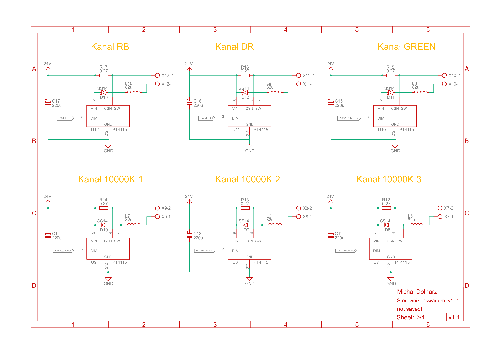

# Sterownik akwarium

W tym repozytorium zawarty jest opis pierwszej wersji sterownika akwarium, przeznaczonego do umieszczenia wewnątrz pokrywy. 

Krótka charakterystyka sprzętowa:
 - mikrokontroler AVR ATMega328P w wersji SMD,
 - zegar RTC,
 - czujnik temperatury wewnątrz pokrywy,
 - czujnik światła,
 - dwa układy sterowania gniazdkami elektrycznymi,
 - złącze wentylatora,
 - złącze wyświetlacza LCD,
 - złącze enkodera.

 Krótka charakterystyka programowa:
 - 2 tryby pracy (zwykły oraz z symulacją wschodu i zachodu),
 - programowanie poprzez menu na wyświetlaczu LCD 4x20 i enkoder obrotowy z przyciskiem,
 - programowanie włączania i wyłączania oświetlenia, gniazdek elektrycznych i wiatraka na każdy dzień tygodnia,
 - programowanie stopnia natężenia światła. 

Schemat układu umieszczono na końcu opisu oraz w plikach w formacie PDF.

## Oświetlenie

Oświetlenie akwarium stanowi popularnie nazywana "belka LED", czyli diody Power LED zamontowane do aluminiowego profilu, który jednocześnie pełni funkcję radiatora. Na belce znajdują się diody w sześciu barwach światła:
 - białe, barwa 6500K (4 szeregi),
 - białe, barwa 10000K (3 szeregi),
 - White Full Spectrum (3 szeregi),
 - Deep Red (1 szereg),
 - zielone (1 szereg),
 - Royal Blue (1 szereg).

Trzy pierwsze barwy stanowią główne oświetlenie. Tak dobrane barwy mają zapewnić najlepsze warunki wzrostu roślin oraz efekt wizualny. Trzy ostatnie barwy stanowią oświetlenie korekcyjne. Zamiast standardowych barw czerwonej i niebieskiej wykorzystywane są specjalistyczne barwy Deep Red i Royal Blue, których światło jest lekko przesunięte w kierunku odpowiednio podczerwieni i ultrafioletu do takich zakresów, które są potrzebne roślinom do prawidłowego wzrostu. Wykorzystanie światła zielonego jest kontrowersyjne i zazwyczaj uważane za niepotrzebne, ale zostało dodane aby przetestować je w praktyce.

Wszystkie diody LED mają moc 1 W, dzięki czemu zastosowano ich większą ilość (w porównaniu do podonych diod 3 W), aby akwarium było bardziej równomiernie oświetlone. 

Za bezpośrednie sterowanie diodami odpowiada układ PT4115 zasilany napięciem 24 V. Każdy szereg diod posiada osobny taki układ, który, w zależności od zadanego sygnału PWM z mikrokontrolera, podaje na szereg prąd maksymalnie do 350 mA. W każdym szeregu znajduje się po 6 diod (za wyjątkiem barwy Deep Red, gdzie diod jest  8). Maksymalny pobór prądu przez samo oświetlenie to około 4,5 A, dostarczany przez przetwornicę.

## Oprogramowanie sterownika

Programowanie sterownika jest oparte o wielopoziomowe menu wyświetlane na wyświetlaczu LCD 4x20, po którym można poruszać się poprzez enkoder obrotowy z przyciskiem. Oba te elementy docelowo miały zostać przymocowane do pokrywy. 

Oprogramowanie uwzględnia dwa tryby prac: naturalny, ze stopniowymi zmianami w akwarium (symulacja wschodu i zachodu) oraz zwykły (natychmiastowe zmiany). Oba tryby pracy mogą (ale nie muszą) sterować zarówno oświetleniem, jak i gniazdkami elektrycznymi oraz wiatrakiem. 

Niezależnie od trybu pracy, dostępne są tzw. szybkie akcje, czyli natychmiastowe włączanie bądź wyłączanie oświetlenia, gniazdek oraz wiatraku. Przydatne narzędzie w momencie prac porządkowych w akwarium, dzięki któremu nie jest wymagane odłączanie kabli.

Wszelkie ustawienia, jak np. czas, data, również są dostępne.

Poniżej zdjęcie sterownika w trakcie tworzenia oprogramowania

## Wschód i zachód

Symulacja wschodu i zachodu w trybie naturalnym to jedna mechanika, rozdzielona na włączanie i wyłączanie akwarium. Ma na celu redukcję stresu obsady akwarium związanego z nagłymi zmianami oświetlenia. 

Wschód i zachód to stopniowa zmiana oświetlenia. Z poziomu menu programuje się czas trwania tych zmian. Stany końcowe to całkowite wyłaczenie oswietlenia oraz oświetlenie zaprogramowane do działania w ciągu dnia. Dostępny jest jeszcze stan przejściowy, który posiada niezależnie programowane oświetlenie. Taki stan można wykorzystać do podbicia barw, np. czerwonej do symulacji zachodzącego słońca lub niebieskiej do stworzenia trybu nocnego na pewien okres.

## Opóźnione akcje

Czujnik światła umozliwia pomiar oświetlenia i podjęcie stosownych akcji. Ta funkcja została dodana z myślą o akwariach znajdujących się w pomieszczaniach, w których często przebywamy. Przykładowo, gdy oświetlenie z rana ma się włączyć, ale w pokoju jest ciemno, bo jeszcze śpimy, włączenie oświetlenia może zostać opóźnione o pewien czas. Podobnie wieczorem, jeżeli jeszcze nie kładziemy się spać, oświetlenie może świecić dłużej, niż zaplanowano.

## Efekt końcowy

Sterownik z oświetleniem zamontowano jeszcze przed wykonaniem pokrywy, z różnych względów.

## Schemat układu

## Rozwój projektu

Wersja druga sterownika zakłada dostęp do ustawień również/tylko poprzez zdalny dostęp z wykrozystaniem modułu ESP8266. Dodatkowo sterownik będzie dostosowany do montażu również bez pokrywy, a więc na belce.  

